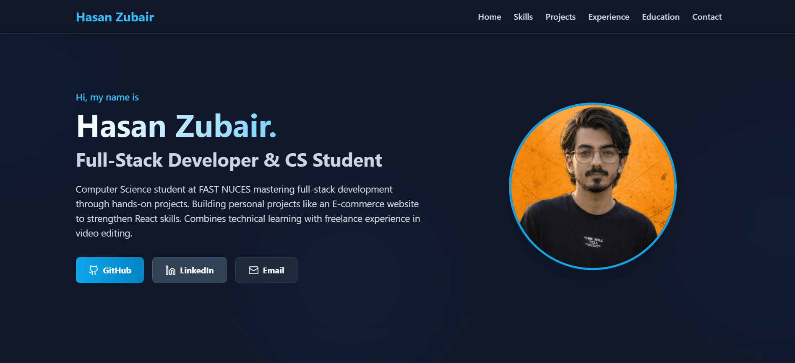

# Hasan Portfolio (Vite + React + Tailwind)

A modern, responsive portfolio website built with Vite, React, and Tailwind CSS.



🚀 **Live Demo:** [View Portfolio](https://68fe559f83e2c60008149e56--hasanzubair-portfolio.netlify.app/)

## Project Structure

```
src/
├── components/
│   ├── common/           # Reusable component building blocks
│   │   ├── ProjectCard.jsx
│   │   ├── SectionWrapper.jsx
│   │   └── SkillCard.jsx
│   └── sections/         # Main page sections
│       ├── Contact.jsx
│       ├── Education.jsx
│       ├── Experience.jsx
│       ├── Footer.jsx
│       ├── Header.jsx
│       ├── Hero.jsx
│       ├── Projects.jsx
│       └── Skills.jsx
├── data/                 # Data layer
│   └── portfolio.js      # Portfolio content and configuration
├── styles/              # Global styles and Tailwind imports
│   └── index.css
├── App.jsx             # Main app component
└── main.jsx           # App entry point
```

## Getting Started

1. Install dependencies:
```powershell
npm install
```

2. Start the development server:
```powershell
npm run dev
```

3. Open http://localhost:5173 in your browser

## Available Scripts

- `npm run dev` - Start development server
- `npm run build` - Build for production
- `npm run preview` - Preview production build
- `npm run lint` - Run ESLint
- `npm run lint:fix` - Fix ESLint errors
- `npm run format` - Format code with Prettier

## Customization

1. Update your portfolio data in `src/data/portfolio.js`
2. Replace placeholder links:
   - GitHub profile (`#github-link`)
   - LinkedIn profile (`#linkedin-link`)
   - Project links (`#github-link-to-project-1` through `#github-link-to-project-7`)
3. Add your profile photo or custom animation in the Hero section

## Technology Stack

- **Framework:** React 18
- **Build Tool:** Vite
- **Styling:** Tailwind CSS
- **Icons:** Lucide React
- **Code Quality:** ESLint + Prettier
- **Development:** Hot Module Replacement (HMR)
